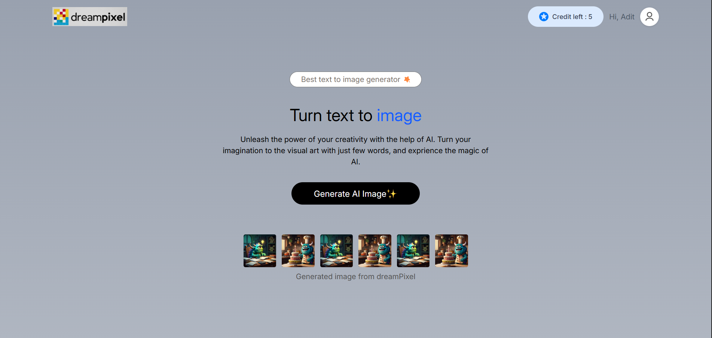
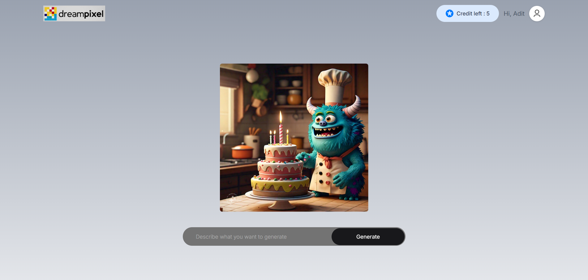
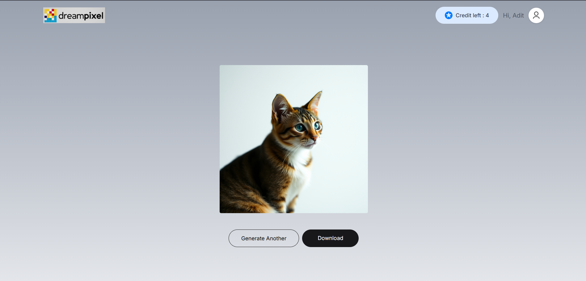
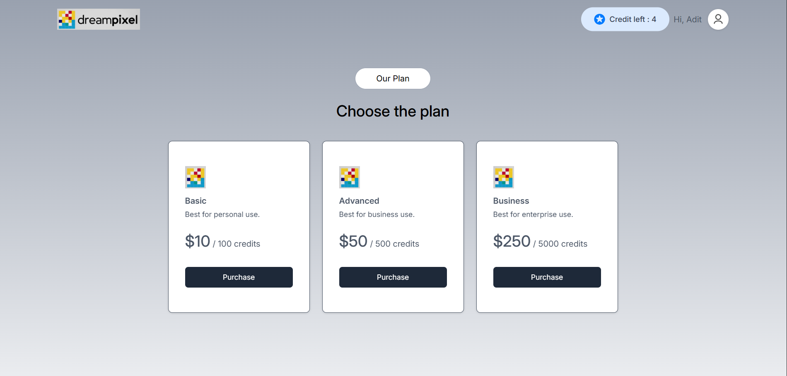
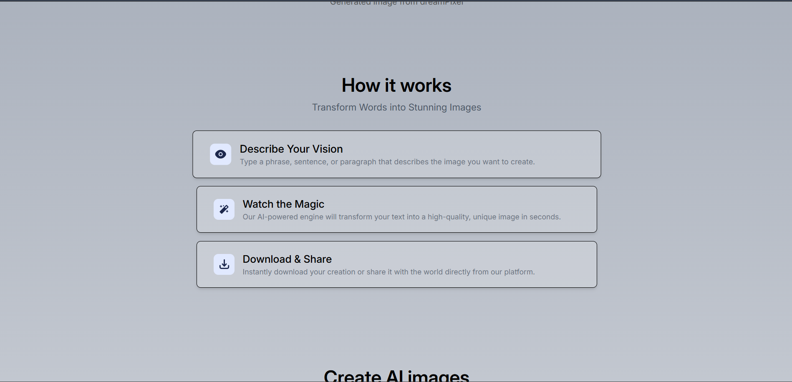
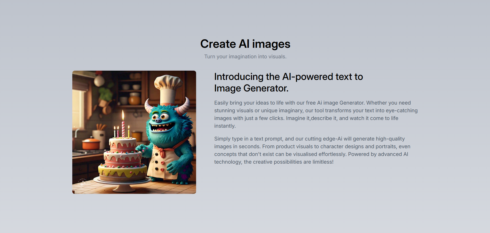

# 🖼️ Text-to-Image Generator AI SaaS App

A full-stack AI-powered SaaS application that allows users to generate images from text prompts using the **Stable Diffusion** model. Built with **React**, **Node.js**, **Express**, and **MongoDB**, this project features secure user authentication, real-time AI image generation, and a clean, responsive UI.

---

## 🚀 Features

- ✍️ Text prompt to image generation
- 🔐 User authentication (signup/login)
- 🗃️ MongoDB for user and prompt data storage
- 🧠 Integration with Stable Diffusion AI model
- 🖼️ Base64-encoded image rendering
- 🔄 Real-time image generation feedback (loading state)
- 📦 Scalable architecture ready for deployment

---

## 🛠️ Tech Stack

**Frontend:**

React
Tailwind CSS (or CSS modules)
Axios
motion
react-router-dom
react-toastify

**Backend:**

Node.js
Express
MongoDB (with Mongoose)
JWT for authentication
axios
cors
bcrypt
dotenv
nodemon
jsonwebtokwn
razorpay

**AI Integration:**

Stable Diffusion (via API or local inference)
AI image generation
---

## 📸 Demo

> A user signs up, enters a prompt like “A cyberpunk city at night,” and receives an AI-generated image within seconds.  
> 

> 

> 

> 

> 

> 

> 
---

## 🧰 Installation

### 📦 Backend Setup

```bash
cd server
npm install
# Create a .env file with your MongoDB URI and JWT_SECRET
npm run server

```
##🌐 Frontend Setup

```bash
cd client
npm install
npm run dev

```


##📂 Folder Structure

##📜 License
This project is licensed under the MIT License.

##🙌 Acknowledgments

Stable Diffusion
Inspired by Nicholas Renotte's tutorial


---

Let me know if you'd like to include deployment steps (e.g., for Vercel, Render, or AWS), or a `requirements.txt` for a Python backend.
